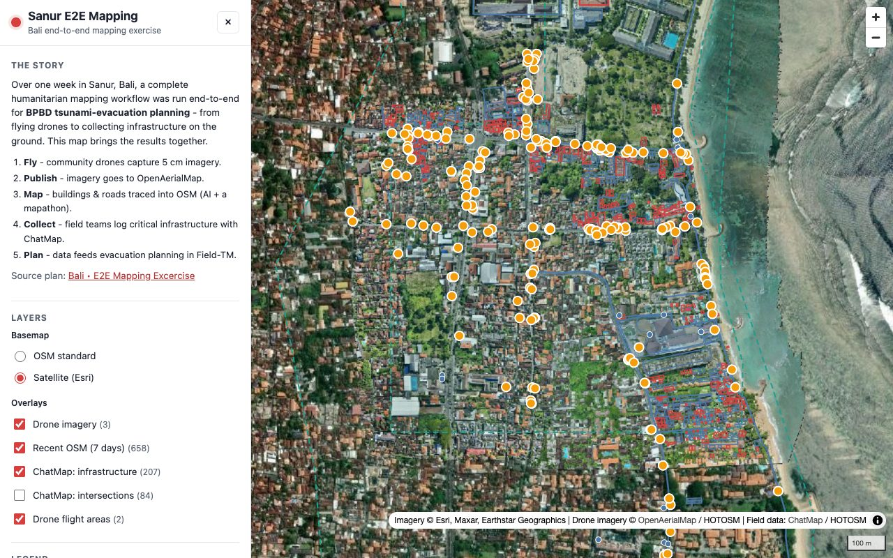

# Sanur E2E Mapping

### 🌏 Live map: <https://cgiovando.github.io/bali-sanur-e2e-map/>

An interactive web map of the **Bali / Sanur end-to-end mapping exercise** - a HOT
(Humanitarian OpenStreetMap Team) workflow run over one week in Sanur, Bali, for
**BPBD tsunami-evacuation planning**. It brings the whole pipeline onto one map:

1. **Fly** - community drones capture 5 cm imagery.
2. **Publish** - imagery is uploaded to OpenAerialMap.
3. **Map** - buildings and roads are traced into OpenStreetMap (AI-assisted + a mapathon).
4. **Collect** - field teams log critical infrastructure with ChatMap.
5. **Plan** - the data feeds evacuation planning in Field-TM.

[](https://cgiovando.github.io/bali-sanur-e2e-map/)

> The map data **refreshes itself automatically**: a scheduled GitHub Action
> re-bakes a rolling 7-day window of OSM edits, the latest OpenAerialMap imagery,
> and ChatMap field points every week (and on demand), then commits and
> redeploys - no manual updates needed.

## Layers

| Layer | Source | Notes |
| --- | --- | --- |
| Drone imagery (5 cm) | [OpenAerialMap](https://openaerialmap.org) via [TiTiler](https://titiler.hotosm.org) | June 2026 captures over Sanur |
| Recent OSM (7 days) | [OpenStreetMap](https://www.openstreetmap.org) via [Overpass](https://overpass-api.de) | New (red) vs edited (blue) features |
| ChatMap: infrastructure | [ChatMap](https://chatmap.hotosm.org) | Field points with photos |
| ChatMap: intersections | ChatMap | Field points |
| Drone flight areas | [HOT Portal](https://portal.hotosm.org) plan | Drone Tasking Manager AOIs |
| Satellite basemap | Esri World Imagery | Optional basemap |

The exercise is coordinated through a single
[HOT Portal plan](https://portal.hotosm.org/en/plan/210951e9-3f1f-492b-91f9-62817b42605e),
which also links a Tasking Manager mapathon and a Field-TM project.

## How it works

The page is a static site (MapLibre GL JS, no framework, no build step). It reads
**baked static data** from `data/` - it never calls the live APIs on page load. A
build script fetches and normalises everything into GeoJSON + a manifest:

```
data/
├── manifest.json                    # layer config, counts, imagery URLs, "last updated"
├── osm-recent.geojson               # recent OSM, new-vs-edited flagged
├── chatmap-infrastructure.geojson
├── chatmap-intersections.geojson
└── drone-aois.geojson
```

Baking (instead of live fetching) keeps the map fast, avoids Overpass rate limits,
and stays up even if a source API is briefly down. A GitHub Action re-bakes the
data weekly.

> Note: "recent OSM" uses each feature's last-edit time (Overpass `newer:`), so a
> few features may be older objects that were merely touched in the window.
> New-vs-edited is inferred from OSM version 1.

## Run locally

```bash
npm install
npm run build:data     # fetch + bake data/ (needs internet; Node 18+)
npm run check:data     # validate the baked output (also: npm test)
npm run serve          # serve at http://localhost:8000
```

Then open <http://localhost:8000>. To refresh the data, re-run `npm run build:data`.
`check:data` guards against regressions (untagged-node clutter, off-AOI
mega-relations, malformed manifest) and runs in CI after every rebuild.

## Deploy & automatic data refresh

The site is hosted on **GitHub Pages** (deploy from `main`, root) at
<https://cgiovando.github.io/bali-sanur-e2e-map/>.

Data is kept current automatically. The
[`refresh-data.yml`](.github/workflows/refresh-data.yml) GitHub Action runs:

- **on a weekly schedule** (Mondays), and
- **on demand** (the "Run workflow" button / `workflow_dispatch`).

Each run re-bakes the data (recomputing the rolling 7-day OSM window at build
time), validates it with `check:data`, and - if anything changed - commits the
updated `data/` back to `main`, which triggers a fresh Pages deploy. So the
published map stays up to date with no manual steps. You can also refresh it
locally any time with `npm run build:data`.

## Project facts

- **~1,260 lines** of source (AI-generated - see
  [AI-assisted development](#ai-assisted-development)), no framework and no
  front-end build step:
  - Front-end app: **~757 lines** (`index.html` 127, `styles.css` 168, `app.js` 462)
  - Data pipeline + validation: **~454 lines** (`build-data.mjs` 368, `check-data.mjs` 86)
  - CI workflow: **49 lines**
- **1 runtime dependency** for the build step (`osmtogeojson`); the map itself
  loads MapLibre GL JS from a CDN.
- **0 API keys / secrets** - every data source is public and key-free.

## Alignment with HOT development best practices

This project follows the open, transparent, reuse-first principles HOT applies
to its tools:

- **Open source, open data** - MIT-licensed code; all layers come from open
  sources (OpenStreetMap, OpenAerialMap, ChatMap, the HOT Portal) and every
  source is **fully attributed** in the UI and this README, with upstream data
  licenses preserved (OSM data under ODbL).
- **Reuse over reinvention** - builds directly on HOT's own stack (MapLibre GL
  JS, OpenAerialMap + TiTiler, Overpass, ChatMap, the HOT Portal API) rather
  than re-implementing it.
- **Reproducible & automated** - a single `npm run build:data` regenerates all
  data deterministically; CI re-bakes, validates, and redeploys on a schedule.
- **Resilient** - data is baked to static files so the live map never depends
  on a third-party API being up at page-load time, and never risks Overpass
  rate limits for visitors; the build retries mirrors and bounds every request
  with a timeout.
- **Accessible & lightweight** - semantic HTML, keyboard-operable controls,
  ARIA labels, sufficient colour contrast, a clear legend, and a
  mobile-responsive layout; the whole front end is a few static files.
- **Secure** - no secrets in the repo; user-facing values from upstream APIs are
  escaped / inserted as text, not raw HTML.
- **Reviewed** - the code was cross-model reviewed and the findings addressed
  before publishing (see the commit history).

## AI-assisted development

> This was a **demonstration / test project**, built almost entirely by AI.

- **[Claude Code](https://claude.ai/claude-code)** (Anthropic) generated essentially all of the code, architecture, and documentation.
- The maintainer **verified the app's functionality** (layers, popups, imagery, responsiveness) in the browser and approved the overall approach - but did **not** perform a line-by-line human code review.
- The code was **cross-model reviewed by AI** (a second model reviewing Claude's output), and those findings were addressed before publishing - see the commit history.

Treat it accordingly: it works and is a useful reference, but it has not had a human code audit.

This disclosure follows emerging best practices for transparency in AI-assisted software development.

## License

[MIT](LICENSE). Map data and imagery remain under their respective licenses:
OpenStreetMap data &copy; OpenStreetMap contributors (ODbL); imagery &copy;
OpenAerialMap / HOTOSM and Esri; field data via ChatMap / HOTOSM.
